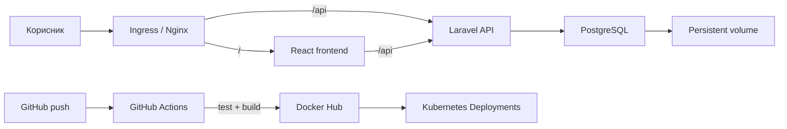

# AgroMarket

AgroMarket е веб-пазар наменет за земјоделци. Корисниците објавуваат огласи за
купување или продажба на механизација, земјоделски производи, добиток, млечни
производи и репроматеријали, го контактираат огласувачот и оставаат оценка за
конкретен производ. Проектот е изработен со React, Laravel и PostgreSQL и е
подготвен за Docker Compose, CI со GitHub Actions и Kubernetes.

> **Важно:** лозинките и `APP_KEY` вредностите во примерите се само за локална
> демонстрација. Заменете ги пред јавно поставување и никогаш не commit-ирајте
> вистинска `.env` датотека или production тајна.

## Функционалности

- регистрација, најава, одјава и token автентикација;
- улоги `user` и `admin`, со посебни административни функции;
- огласи од тип `sell` или `buy` и состојба `active` или `inactive`;
- категории групирани како механизација, посеви, добиток, млечни производи,
  репроматеријали и друго;
- пребарување и филтрирање по категорија, група, тип, состојба, корисник и
  ценовен опсег;
- сортирање по најнови, цена растечки/опаѓачки и оценка;
- сопствен профил со активни и неактивни огласи, директно уредување и бришење
  со потврда;
- јавен профил на продавачот со неговите производи и контакт податоци;
- оценки од 1 до 5 и коментар за конкретен оглас, видливи за сите корисници;
- заштита со policies: сопственикот управува само со своите огласи и не може да
  се оценува самиот себе;
- административно управување со корисници, категории и огласи.

## Архитектура



Во Docker Compose има точно три апликациски сервиси:

| Сервис | Улога | Внатрешна порта |
|---|---|---:|
| `frontend` | React production build сервиран со Nginx | 80 |
| `backend` | Laravel REST API | 8000 |
| `database` | PostgreSQL со траен именуван volume | 5432 |

Nginx го препраќа `/api/*` кон `backend:8000`, па прелистувачот комуницира со
иста адреса и не зависи од Docker DNS. Базата не се објавува на host машината.

## Структура

```text
agromarket/
├── backend/                 # Laravel API, модели, миграции, policies и tests
├── frontend/                # React/Vite кориснички интерфејс
├── docker/                  # production Dockerfiles, entrypoint и Nginx
├── k8s/                     # Kubernetes manifests и Kustomize
├── .github/workflows/ci.yml # CI и објавување images
├── compose.yaml             # локална оркестрација на трите сервиси
└── docs/demo-script.md      # кратко сценарио за презентација
```

## Брзо стартување со Docker Compose

Потребни се Docker Desktop или Docker Engine со Compose v2. Од коренот на
репозиториумот:

```powershell
Copy-Item .env.example .env
docker compose config --quiet
docker compose up --build -d
docker compose ps
```

Отворете:

- апликација: [http://localhost:8080](http://localhost:8080)
- Laravel health endpoint: [http://localhost:8000/up](http://localhost:8000/up)

Backend entrypoint-от ја чека PostgreSQL базата, извршува `migrate --force`, а
потоа и demo seeder-от. Seeder-от користи `firstOrCreate`, па повторното
стартување не менува постојни лозинки, огласи или оценки. Првото стартување
може да трае малку
подолго. Состојбата на сервисите се гледа со:

```powershell
docker compose logs -f backend
docker compose ps
```

### Демонстрациска сметка

| Улога | Е-пошта | Лозинка |
|---|---|---|
| Администратор | `admin@agromarket.mk` | `Admin123!` |
| Корисник | `elena@example.com` | `Password123!` |
| Корисник | `nikola@example.com` | `Password123!` |
| Корисник | `marija@example.com` | `Password123!` |

Овие локални лозинки доаѓаат од `SEED_ADMIN_PASSWORD` и `SEED_USER_PASSWORD`
во `.env`. Променете ги пред околината да стане достапна надвор од вашиот
компјутер.

Може да се креира и нов корисник преку страницата **Регистрација**. По
демонстрацијата сервисите се запираат со `docker compose down`.

За целосно бришење на локалната база може да се употреби командата подолу.
Ова е намерно деструктивна операција и ги брише сите локални огласи и оценки:

```powershell
docker compose down --volumes
```

## API преглед

Основната адреса е `/api`. API враќа JSON, а за заштитените рути се испраќа
`Authorization: Bearer <token>`.

| Област | Рути и намена |
|---|---|
| Автентикација | `/auth/register`, `/auth/login`, `/auth/logout`, `/auth/me` |
| Категории | јавна листа на категории |
| Огласи | јавна листа/детали и заштитено креирање, уредување и бришење |
| Мои огласи | `/my/listings`, вклучува активни и неактивни огласи |
| Корисници | јавен профил, производи и просечна оценка |
| Оценки | креирање, измена и бришење оценка за конкретен оглас |
| Администрација | `/admin/*` за корисници, категории и модерирање огласи |

Пример за пребарување активни огласи за продажба, со цена од најниска кон
највисока:

```text
GET /api/listings?status=active&listing_type=sell&group=machinery&sort=price_asc
```

Поддржани query параметри се `search`, `category`, `group`, `listing_type`,
`status`, `user_id`, `min_price`, `max_price`, `sort` и `per_page`.

## Поставување во јавен Git репозиториум

Креирајте празен **Public** репозиториум на GitHub, без автоматски README, па од
коренот на проектот извршете:

```powershell
git init
git add .
git commit -m "Initial AgroMarket application"
git branch -M main
git remote add origin https://github.com/YOUR_USERNAME/agromarket.git
git push -u origin main
```

Проверете дека `.env` не се појавува во `git status` и дека репозиториумот е
видлив во приватен/incognito прозорец. За секоја следна промена користете branch
и pull request, така што CI проверките ќе се извршат пред merge.

## GitHub Actions CI

Workflow-от [`.github/workflows/ci.yml`](.github/workflows/ci.yml) се активира на
pull request и push кон `main`:

1. го валидира Composer проектот, проверува Laravel стил, пушта миграции врз
   изолиран PostgreSQL service container и ги извршува backend тестовите;
2. со заклучениот `pnpm-lock.yaml` ги инсталира frontend зависностите, пушта
   ESLint и unit тестови и прави production React build;
3. само по успешни проверки и push на `main`, паралелно ги гради и објавува
   `agromarket-backend` и `agromarket-frontend` на Docker Hub;
4. секој image добива непроменлив tag со целосниот Git commit SHA и подвижен
   `latest` tag.

Во GitHub отворете **Settings → Secrets and variables → Actions** и додајте:

| Repository secret | Вредност |
|---|---|
| `DOCKERHUB_USERNAME` | Docker Hub корисничко име |
| `DOCKERHUB_TOKEN` | Docker Hub access token, не лозинката на сметката |

На Docker Hub креирајте два јавни репозиториума:

- `YOUR_USERNAME/agromarket-backend`
- `YOUR_USERNAME/agromarket-frontend`

## Kubernetes

Manifest-ите се во посебниот namespace `agromarket` и содржат:

- ConfigMap и Secret за Laravel/PostgreSQL конфигурацијата;
- Laravel Deployment и ClusterIP Service;
- React/Nginx Deployment со две реплики и ClusterIP Service;
- PostgreSQL StatefulSet, headless Service, обичен Service и PVC template од
  `5Gi`;
- Traefik Ingress: `/api` оди директно кон backend, а `/` кон frontend;
- startup/readiness/liveness probes и resource requests/limits.

### 1. Подготовка

Пред deployment:

1. во `k8s/backend-deployment.yaml` и `k8s/frontend-deployment.yaml` заменете
   `DOCKERHUB_USERNAME` со сопственото Docker Hub корисничко име;
2. заменете ги сите demo вредности во `k8s/secret.yaml`;
3. проверете дека кластерот има default `StorageClass`;
4. ако кластерот користи Nginx наместо Traefik, променете
   `ingressClassName: traefik` во `ingressClassName: nginx`;
5. оставете `SEED_DATABASE: "false"` за shared/public кластер. Seeder-от се
   пушта само еднаш, откако ќе ги замените лозинките во Secret.

За нов Laravel клуч може да се генерира вредност со:

```powershell
docker run --rm php:8.3-cli php -r "echo 'base64:'.base64_encode(random_bytes(32)).PHP_EOL;"
```

Не commit-ирајте production тајни. За реална околина употребете Sealed Secrets,
External Secrets или secret manager од cloud провајдерот.

### 2. Deployment

```powershell
kubectl apply -k k8s
kubectl rollout status statefulset/postgres -n agromarket --timeout=180s
kubectl rollout status deployment/backend -n agromarket --timeout=180s
kubectl rollout status deployment/frontend -n agromarket --timeout=180s
kubectl exec -n agromarket deployment/backend -- php artisan db:seed --force
kubectl get all,ingress,pvc,configmap,secret -n agromarket
```

Командата `db:seed` е за демонстрациски податоци. Прескокнете ја ако сакате
празна production база; првиот обичен корисник може да се регистрира преку UI,
а администраторска сметка треба да се создаде преку контролиран provisioning
процес.

За локален K3d кластер со вграден Traefik може, на пример, да се отвори портата
80 при креирање:

```powershell
k3d cluster create agromarket --agents 1 -p "80:80@loadbalancer"
```

Додајте `127.0.0.1 agromarket.local` во Windows hosts датотеката со
администраторски права, па отворете [http://agromarket.local](http://agromarket.local).
Ако port mapping или hosts датотека не се достапни, за демонстрација може:

```powershell
kubectl port-forward -n agromarket service/frontend 8080:80
```

Потоа апликацијата е достапна на `http://localhost:8080`; Nginx во frontend pod-от
и понатаму го препраќа `/api` кон Kubernetes Service-от `backend`.

### 3. Доказ дека работи

```powershell
kubectl get pods -n agromarket
kubectl get ingress -n agromarket
kubectl get pvc -n agromarket
kubectl logs -n agromarket deployment/backend --tail=100
kubectl exec -n agromarket statefulset/postgres -- pg_isready -U agromarket -d agromarket
```

Очекувано е сите Pods да бидат `Running` и `Ready`, PVC да биде `Bound`,
Ingress да го прикажува host-от `agromarket.local`, а `pg_isready` да врати дека
базата прифаќа конекции. Целото сценарио за усна демонстрација е во
[`docs/demo-script.md`](docs/demo-script.md).

## Мапирање кон проектните барања

| Барање | Имплементација | Локација |
|---|---|---|
| Јавен Git репозиториум (10%) | чекори за public GitHub repo и branch/PR workflow | овој README |
| Docker (10%) | посебен multi-stage image за Laravel и React/Nginx | `docker/` |
| Docker Compose (10%) | frontend, backend и PostgreSQL, health checks и volume | `compose.yaml` |
| CI (20%) | lint/test/build и push на два images со `latest` + SHA | `.github/workflows/ci.yml` |
| Deployment + ConfigMap/Secret (10%) | Laravel Deployment, probes и конфигурација | `k8s/backend-deployment.yaml` |
| Service (10%) | посебни ClusterIP Services | `k8s/*-service.yaml` |
| Ingress (10%) | host и path routing за `/api` и `/` | `k8s/ingress.yaml` |
| StatefulSet (10%) | PostgreSQL, headless Service и траен PVC | `k8s/postgres-statefulset.yaml` |
| Посебен namespace и демонстрација (10%) | Kustomize deployment и доказни команди | `k8s/namespace.yaml`, `docs/demo-script.md` |

Проектниот домен, моделите, категориите, конфигурацијата, имињата на ресурсите и
deployment сценариото се специфични за AgroMarket и не се преземени како
идентични примери од предавањата.

## Лиценца

Кодот е достапен под [MIT лиценца](LICENSE).
