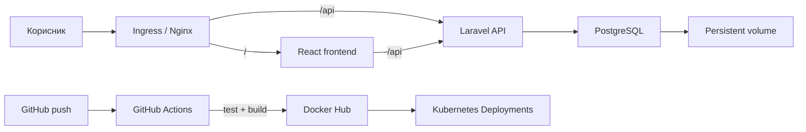

# AgroMarket

AgroMarket е веб-пазар наменет за земјоделци. Корисниците објавуваат огласи за
купување или продажба на механизација, земјоделски производи, добиток, млечни
производи и репроматеријали, го контактираат огласувачот и оставаат оценка за
конкретен производ. Проектот е изработен со React, Laravel и PostgreSQL и е
подготвен за Docker Compose, CI со GitHub Actions и Kubernetes.

> **Важно:** лозинките и `APP_KEY` вредностите во примерите се само за локална
> демонстрација. Заменете ги пред јавно поставување и никогаш не commit-ирајте
> вистинска `.env` датотека или production тајна.

## Функционалности

- регистрација, најава, одјава и token автентикација;
- улоги `user` и `admin`, со посебни административни функции;
- огласи од тип `sell` или `buy` и состојба `active` или `inactive`;
- категории групирани како механизација, посеви, добиток, млечни производи,
  репроматеријали и друго;
- пребарување и филтрирање по категорија, група, тип, состојба, корисник и
  ценовен опсег;
- сортирање по најнови, цена растечки/опаѓачки и оценка;
- сопствен профил со активни и неактивни огласи, директно уредување и бришење
  со потврда;
- јавен профил на продавачот со неговите производи и контакт податоци;
- оценки од 1 до 5 и коментар за конкретен оглас, видливи за сите корисници;
- заштита со policies: сопственикот управува само со своите огласи и не може да
  се оценува самиот себе;
- административно управување со корисници, категории и огласи.

## Архитектура



Во Docker Compose има точно три апликациски сервиси:

| Сервис | Улога | Внатрешна порта |
|---|---|---:|
| `frontend` | React production build сервиран со Nginx | 80 |
| `backend` | Laravel REST API | 8000 |
| `database` | PostgreSQL со траен именуван volume | 5432 |

Nginx го препраќа `/api/*` кон `backend:8000`, па прелистувачот комуницира со
иста адреса и не зависи од Docker DNS. Базата не се објавува на host машината.

## Структура

```text
agromarket/
├── backend/                 # Laravel API, модели, миграции, policies и tests
├── frontend/                # React/Vite кориснички интерфејс
├── docker/                  # production Dockerfiles, entrypoint и Nginx
├── k8s/                     # Kubernetes manifests и Kustomize
├── .github/workflows/ci.yml # CI и објавување images
├── compose.yaml             # локална оркестрација на трите сервиси
└── docs/demo-script.md      # кратко сценарио за презентација
```

## Брзо стартување со Docker Compose

Потребни се Docker Desktop или Docker Engine со Compose v2. Од коренот на
репозиториумот:

```powershell
Copy-Item .env.example .env
docker compose config --quiet
docker compose up --build -d
docker compose ps
```

Отворете:

- апликација: [http://localhost:8080](http://localhost:8080)
- Laravel health endpoint: [http://localhost:8000/up](http://localhost:8000/up)

Backend entrypoint-от ја чека PostgreSQL базата, извршува `migrate --force`, а
потоа и demo seeder-от. Seeder-от користи `firstOrCreate`, па повторното
стартување не менува постојни лозинки, огласи или оценки. Првото стартување
може да трае малку
подолго. Состојбата на сервисите се гледа со:

```powershell
docker compose logs -f backend
docker compose ps
```

### Демонстрациска сметка

| Улога | Е-пошта | Лозинка |
|---|---|---|
| Администратор | `admin@agromarket.mk` | `Admin123!` |
| Корисник | `elena@example.com` | `Password123!` |
| Корисник | `nikola@example.com` | `Password123!` |
| Корисник | `marija@example.com` | `Password123!` |

Овие локални лозинки доаѓаат од `SEED_ADMIN_PASSWORD` и `SEED_USER_PASSWORD`
во `.env`. Променете ги пред околината да стане достапна надвор од вашиот
компјутер.

Може да се креира и нов корисник преку страницата **Регистрација**. По
демонстрацијата сервисите се запираат со `docker compose down`.

За целосно бришење на локалната база може да се употреби командата подолу.
Ова е намерно деструктивна операција и ги брише сите локални огласи и оценки:

```powershell
docker compose down --volumes
```

## API преглед

Основната адреса е `/api`. API враќа JSON, а за заштитените рути се испраќа
`Authorization: Bearer <token>`.

| Област | Рути и намена |
|---|---|
| Автентикација | `/auth/register`, `/auth/login`, `/auth/logout`, `/auth/me` |
| Категории | јавна листа на категории |
| Огласи | јавна листа/детали и заштитено креирање, уредување и бришење |
| Мои огласи | `/my/listings`, вклучува активни и неактивни огласи |
| Корисници | јавен профил, производи и просечна оценка |
| Оценки | креирање, измена и бришење оценка за конкретен оглас |
| Администрација | `/admin/*` за корисници, категории и модерирање огласи |

Пример за пребарување активни огласи за продажба, со цена од најниска кон
највисока:

```text
GET /api/listings?status=active&listing_type=sell&group=machinery&sort=price_asc
```

Поддржани query параметри се `search`, `category`, `group`, `listing_type`,
`status`, `user_id`, `min_price`, `max_price`, `sort` и `per_page`.


## Лиценца

Кодот е достапен под [MIT лиценца](LICENSE).
